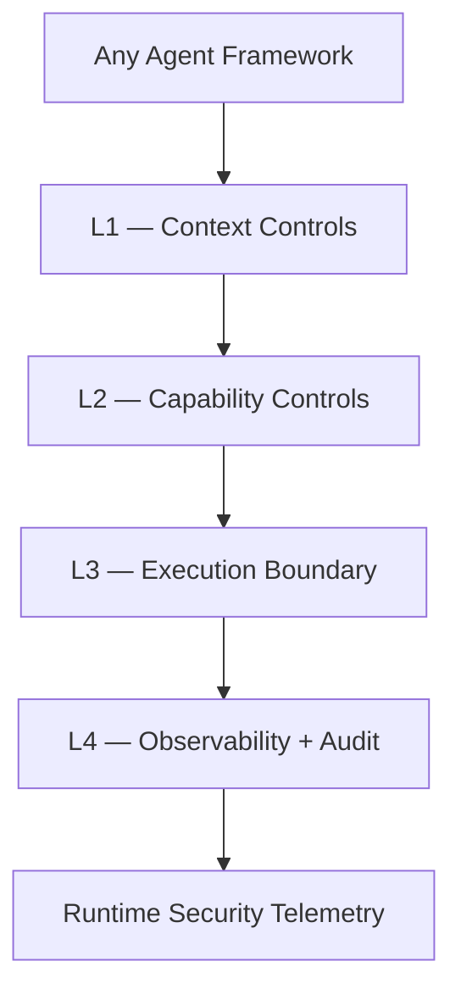
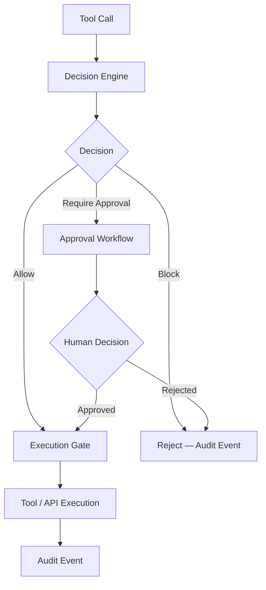
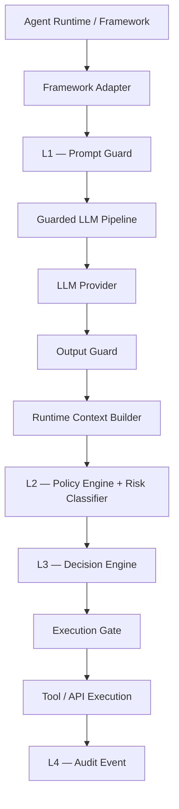
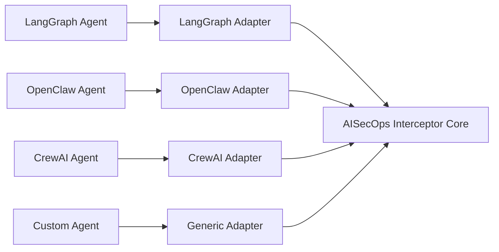

## Reference Architecture

A structured blueprint for deploying runtime security across agentic AI systems —
from prompt ingestion to tool execution and audit.

aisecops.net · Last updated March 2026 · ~7 min read

---

### What This Architecture Addresses

Most agentic AI deployments today have no runtime security layer. The LLM is called directly,
tool permissions are broad, outputs are passed through without inspection, and there is no
structured audit trail.

This works fine in a demo. It does not work in production.

The AISecOps reference architecture describes where security controls must be placed in an
agentic AI system, what each control does, and how they compose into a runtime enforcement layer
that is framework-agnostic — the same architecture applies whether your agent runtime is
OpenClaw, LangGraph, CrewAI, AutoGen, or a custom system.

The architecture is organized around four control layers that correspond directly to the
four threat layers described in the [Threat Model](https://aisecops.net/threat-model).

---

### The Four Control Layers



Each layer addresses a distinct threat surface. No single layer is sufficient.
The architecture requires all four operating together.

---

### L1 — Context Controls

**Threat addressed:** Prompt injection, indirect injection via retrieval, memory poisoning  
**Position in runtime:** Before the LLM is called

The first enforcement boundary sits at the edge of the model's context window. Everything that
enters the model — user prompts, retrieved documents, tool results, memory reads, agent messages —
is treated as untrusted input until it has been inspected.

### Prompt Guard

Scans all input content before it reaches the model. Detects:

- direct prompt injection patterns
- instruction override attempts
- jailbreak framing
- embedded adversarial instructions in retrieved content

Detected violations raise `LLMGuardViolationError` and halt the pipeline before the model is
called. The event is emitted with full context: input source, detection type, severity.

### Output Guard

Scans every model response before it reaches the agent runtime. Detects:

- secret and credential patterns in generated text
- PII present in model output
- data exfiltration attempts embedded in tool call arguments
- adversarial instructions in responses destined for downstream agents

Detected violations suppress the response and emit a structured security event.

### Runtime Context Builder

Constructs a typed `RuntimeContext` object that carries provenance and classification metadata
through the full pipeline:

- `source` — origin of the input (user, retrieval, tool result, agent message)
- `data_classification` — sensitivity classification of the content
- `sensitivity_level` — low / medium / high, used in downstream policy evaluation
- `agent_name` — verified identity of the calling agent

This context object is passed from the prompt guard through to the decision engine, ensuring
that every security decision is made with full awareness of where the input came from and
what it contains.

---

### L2 — Capability Controls

**Threat addressed:** Tool execution abuse, unauthorized tool invocation, tool chaining  
**Position in runtime:** Before any tool or API is executed

The second enforcement boundary governs what the agent is permitted to do. Tool access is not
a binary permission — it is a policy surface. The capability control layer evaluates every
tool call against a declarative policy before execution is permitted.

### Policy Engine

Evaluates tool calls against an ordered set of declarative rules. Each rule matches on:

- `tool_name` — the specific tool being called
- `agent_name` — the verified identity of the calling agent (optional)
- `sensitivity_level` — the classification carried in the RuntimeContext (optional)

The first matching rule wins. If no rule matches, fallback policy logic applies — covering
blocked tools, dangerous argument patterns, allowlists, and monitored tools.

**Example rule configuration:**

```python
policy = PolicyEngine(
    {
        "rules": [
            {"tool_name": "restart_service", "agent_name": "ops_agent", "action": "require_approval"},
            {"tool_name": "read_customer", "sensitivity_level": "high", "action": "block"},
            {"tool_name": "send_email", "action": "require_approval"},
        ]
    }
)
```

Policy decisions are scoped to verified runtime identity — not to claimed identity in message
content. An agent cannot grant itself permissions it was not provisioned with at runtime.

### Risk Classifier

Assigns a risk level (`low`, `medium`, `high`) to each tool call based on the tool name,
arguments, and the RuntimeContext. Risk level feeds into policy evaluation and is recorded
in the audit event — enabling risk-weighted reporting and alerting downstream.

---

### L3 — Execution Boundary

**Threat addressed:** Approval bypass, irreversible actions, privilege escalation  
**Position in runtime:** At the point of execution

The third enforcement boundary is the execution gate. After policy evaluation, every tool call
reaches one of three outcomes:



### Decision Engine

Takes the RuntimeContext, policy evaluation result, and risk classification as inputs.
Returns a typed decision: `allow`, `block`, or `require_approval`. The decision phase and
execution phase are explicitly separate — no tool executes without passing through the
decision engine first.

### Execution Gate

The enforcement point. Permitted tool calls pass through; blocked calls are rejected with a
structured reason; approval-required calls are suspended pending human decision.

### Approval Workflow

Human-in-the-loop gating for sensitive actions:

1. Agent requests a tool call that policy marks `require_approval`
2. Interceptor creates a scoped `approval_id` bound to the specific tool call context
3. Human reviews and approves or rejects
4. Approved calls are replayed through the execution gate with the `approval_id`
5. The approval decision is recorded as a distinct audit event

Approval IDs are scoped to the exact tool call for which they were issued. Replay attacks —
reusing an approval ID for a different call — are rejected.

---

### L4 — Observability and Audit

**Threat addressed:** Audit blindness, policy drift, forensic gaps  
**Position in runtime:** All layers — every decision point emits an event

The fourth layer is not a gate — it is a thread that runs through the entire runtime.
Every security decision emits a structured event. The audit trail is the forensic record
of the decision chain, not a log of what happened.

### Structured Event Model

Events are emitted at every enforcement boundary:

| Event | Layer | Carries |
|---|---|---|
| `prompt_allowed` / `prompt_blocked` | L1 | input source, detection type, severity |
| `output_allowed` / `output_blocked` | L1 | response hash, detection type, data classification |
| `tool_allowed` | L2/L3 | tool name, agent name, matched rule, risk level |
| `tool_blocked` | L2/L3 | tool name, agent name, block reason, matched rule |
| `tool_approval_required` | L3 | tool name, agent name, approval ID |
| `approval_issued` | L3 | approval ID, tool call context |
| `approval_granted` / `approval_rejected` | L3 | approval ID, decision timestamp, reviewer |

Every event carries `agent_name`, `tool_name`, `matched_rule`, `sensitivity_level`,
`data_classification`, and `timestamp`. The audit trail enables:

- forensic replay of any session
- policy regression detection across deployments
- risk-weighted reporting and alerting
- compliance evidence for enterprise governance requirements

---

### Full Runtime Security Pipeline

This diagram shows the complete flow from agent prompt to tool execution across all four layers.



Adapters are thin. All security logic lives inside the interceptor core.
Framework integrations do not contain policy logic — policy, risk, approval, and audit
stay in the runtime.

---

### Framework Integration Model

The architecture is framework-agnostic by design. Agent frameworks plug in via thin adapters
that translate framework-specific tool call representations into a common AISecOps execution
contract.



**Design rule:** Adapters translate. They do not enforce. Security logic lives in the core,
not in the integration layer.

Current adapters: LangGraph-style, OpenClaw-style, generic.  
Roadmap: native integrations for production LangGraph and OpenClaw execution paths.

---

### Deployment Model

The AISecOps Interceptor is designed to deploy as a library embedded in the agent runtime,
not as a network proxy or sidecar. This means:

- **zero network hop** — enforcement happens in-process, not over a service call
- **no single point of failure** — the interceptor fails closed, not open
- **portable** — the same runtime works across cloud, on-premise, and local deployments

The FastAPI wrapper is provided for local testing and API-based integration scenarios.
It is not the recommended production deployment model — direct library integration is preferred.

---

### What Is Not Yet in the Architecture

An honest architecture document names what is missing.

**Persistent audit storage.** The current implementation emits structured events but does not
include a durable audit store. Production deployments will need to route events to a SIEM,
a time-series store, or a purpose-built audit backend. This is on the roadmap.

**Policy provider abstraction beyond YAML.** The current policy engine supports YAML-defined
rules and declarative Python configuration. A policy provider abstraction — enabling dynamic
policy from OPA, a database, or a control plane API — is a near-term priority.

**Native real framework integrations.** The current LangGraph and OpenClaw adapters are
style-compatible implementations. Native integration with the production execution paths
of these frameworks is on the roadmap.

**Behavioural baseline and anomaly detection.** The current architecture enforces explicit
policy. It does not yet detect anomalous agent behaviour that falls within policy bounds but
deviates from established baselines. This is a longer-horizon capability.

---

### Where to Go From Here

This page describes the architecture. The [Threat Model](https://aisecops.net/threat-model)
explains what each layer defends against. The [Open Source](https://aisecops.net/open-source)
page shows the working implementation across all four layers.

If you are evaluating this architecture for an enterprise deployment, the whitepaper covers
governance requirements, compliance considerations, and adoption patterns in detail.

---

V

Viplav Fauzdar

Building AISecOps as a discipline and open-source reference implementation.
Java/Spring + Python practitioner. Focused on practical, shipped security for agentic AI — not slide decks.

[Medium ↗](https://medium.com/@viplav.fauzdar) [GitHub ↗](https://github.com/viplavfauzdar) [LinkedIn ↗](https://linkedin.com/in/viplavfauzdar)

---

**On This Page**

- 01 What This Architecture Addresses
- 02 The Four Control Layers
- 03 L1 — Context Controls
- 04 L2 — Capability Controls
- 05 L3 — Execution Boundary
- 06 L4 — Observability and Audit
- 07 Full Runtime Security Pipeline
- 08 Framework Integration Model
- 09 Deployment Model
- 10 What Is Not Yet in the Architecture

---

**Related Pages**

- [Threat Model for Agentic AI →](https://aisecops.net/threat-model)
- [Definition: What Is AISecOps? →](https://aisecops.net/definition)
- [Open Source Implementations →](https://aisecops.net/open-source)
- [Get the Whitepaper →](https://aisecops.net/whitepaper)
