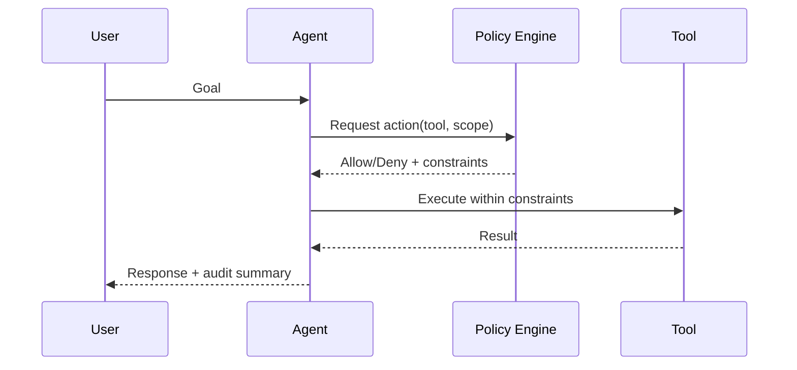

Example sequence (Mermaid):

```mermaid
sequenceDiagram
  participant U as User
  participant A as Agent
  participant P as Policy Engine
  participant T as Tool
  U->>A: Goal
  A->>P: Request action(tool, scope)
  P-->>A: Allow/Deny + constraints
  A->>T: Execute within constraints
  T-->>A: Result
  A-->>U: Response + audit summary
```
