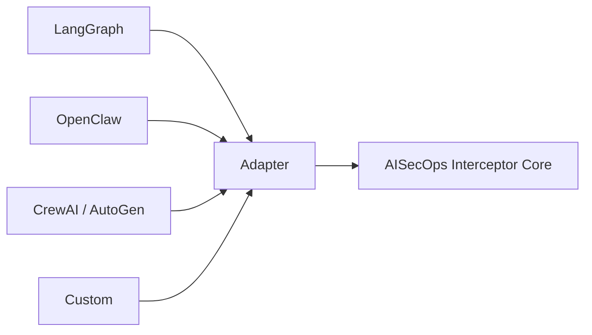

## Open Source

The AISecOps runtime enforcement layer — available now as an open-source reference implementation.

aisecops.net · Last updated March 2026 · ~6 min read

---

### What Is Here

AISecOps Interceptor is the open-source implementation of the
[AISecOps reference architecture](https://aisecops.net/reference-architecture).
It is a framework-agnostic runtime security layer for agentic AI systems — covering prompt
inspection, output inspection, policy-based tool governance, human approval workflows,
and structured audit telemetry.

This is not a demo or a prototype. It is the working product core — the same implementation
described in the architecture and threat model pages, in runnable Python.

**License:** Apache 2.0

---

### The Repository

**[github.com/viplavfauzdar/aisecops-interceptor ↗](https://github.com/viplavfauzdar/aisecops-interceptor)**

Python · Apache 2.0 · Works with Python 3.11–3.13

---

### What the Interceptor Covers

The implementation addresses both critical enforcement layers of an agentic AI system.

### Prompt and Output Layer

Everything that enters the model and everything the model returns is inspected before
the agent runtime sees it.

- **Input Inspector** — scans all prompt content before the LLM is called. Detects direct
  prompt injection, instruction override attempts, and adversarial instructions embedded
  in retrieved content. Violations raise `LLMGuardViolationError` and halt the pipeline.

- **Output Inspector** — scans every model response before it reaches the agent. Detects
  secret and credential patterns, PII in generated output, and data exfiltration attempts
  embedded in tool call arguments.

- **Guarded LLM Pipeline** — wraps any supported LLM provider in an inspect-call-inspect
  loop. Accepts a `RuntimeContext` and propagates source, classification, and sensitivity
  metadata through guard checks. Emits structured security events at every stage.

- **Supported providers:** OpenAI, Anthropic (Claude), Ollama (local models). All providers
  implement the same interface: `LLMClient.chat(LLMRequest) → LLMResponse`.

### Tool Execution Layer

Every tool call is evaluated against policy before execution is permitted.

- **Policy Engine** — evaluates tool calls against an ordered set of declarative rules.
  Rules match on `tool_name`, `agent_name`, and `sensitivity_level`. First match wins;
  fallback logic covers blocked tools, dangerous arguments, allowlists, and monitored tools.

- **YAML Policy Bundles** — declarative rules can be loaded from YAML files with
  `PolicyEngine.from_yaml("policies/production.yaml")`. Bundles are validated before rules
  are constructed; invalid bundles raise a validation error at load time, not at runtime.

- **Decision Engine** — takes `RuntimeContext`, policy result, and risk classification as
  inputs. Returns a typed decision: `allow`, `block`, or `require_approval`. Decision phase
  and execution phase are explicitly separated.

- **Execution Gate** — the enforcement point. Permitted calls pass through; blocked calls
  are rejected with a structured reason; approval-required calls are suspended.

- **Approval Workflow** — human-in-the-loop gating for sensitive actions. Approval IDs are
  scoped to the exact tool call context for which they were issued. Replay attacks are rejected.

---

### Audit and Event Telemetry

Every enforcement decision emits a structured `RuntimeEvent`. The audit system is not a log
of what happened — it is a forensic record of the decision chain.

Events are emitted at every enforcement boundary:

| Event | Stage |
|---|---|
| `prompt_allowed` / `prompt_blocked` | Prompt guard |
| `output_allowed` / `output_blocked` | Output guard |
| `tool_allowed` / `tool_blocked` | Policy + execution gate |
| `tool_approval_required` | Approval workflow |
| `approval_issued` / `approval_granted` / `approval_rejected` | Approval workflow |

Every event carries `agent_name`, `tool_name`, `matched_rule`, `sensitivity_level`,
`data_classification`, `correlation_id`, and `timestamp`.

The `correlation_id` field traces a complete decision chain — from prompt inspection through
output inspection to tool execution — as a single forensic record.

### Multi-Sink Delivery

`AuditLogger` supports simultaneous delivery to multiple sinks:

- **JSONL file persistence** — structured events written to disk for durable audit storage
- **In-memory collection** — for testing and local inspection
- **Webhook delivery** — structured events posted to external HTTP endpoints for SIEM
  integration or downstream alerting

Sink delivery is isolated per sink — one failing sink does not block delivery to others.
Sink failures are recorded in-memory and exposed via `/audit/failures` for local inspection.

### Queryable Audit API

The `/audit` endpoint supports filtering by: `event_type`, `stage`, `agent_name`,
`tool_name`, `correlation_id`, and `limit`.

---

### Quick Start

```bash
# create environment
python3.13 -m venv .venv
source .venv/bin/activate

# install dependencies
pip install -r requirements.txt

# run tests
pytest -q
# → 47 passed

# run the API
uvicorn aisecops_interceptor.api.main:app --reload

# run demos
python -m examples.agent_demo
python examples/demo.py
python -m examples.langgraph_style_demo
python examples/openclaw_demo.py
python -m examples.policy_bundle_demo
```

Python 3.11 through 3.13. Python 3.14 currently fails on `pydantic-core` build.

---

### Policy Bundle Example

Define runtime policy as a YAML file — no code required:

```yaml
rules:
  - tool_name: restart_service
    agent_name: ops_agent
    action: require_approval

  - tool_name: read_customer
    sensitivity_level: high
    action: block

  - tool_name: send_email
    action: require_approval
```

Load at runtime:

```python
policy = PolicyEngine.from_yaml("policies/production.yaml")
```

Bundles are validated on load. Invalid bundles raise before any agent executes.

---

### Repository Structure

```text
aisecops_interceptor/

  core/           interceptor, policy, approval, audit,
                  context, decision, execution, events

  guard/          detectors, input inspector, output inspector

  llm/            pipeline, providers (OpenAI, Anthropic, Ollama),
                  factory, config, models

  policy/         rule engine, rules, schema, loader

  integrations/   LangGraph adapter, OpenClaw adapter, generic adapter

  api/            FastAPI wrapper (testing + local development)

examples/         agent_demo, demo, langgraph_style_demo,
                  openclaw_demo, policy_bundle_demo

tests/            47 tests across all layers
```

---

### What Is Coming Next

The interceptor is in active development. Current engineering focus:

- richer policy engine with broader declarative coverage
- persistent audit storage backend
- advanced prompt attack detection
- native integrations for production LangGraph and OpenClaw execution paths
- behavioural baseline and anomaly detection

---

### Framework Integration

The interceptor integrates with any agent framework via thin adapters. Current adapters:
LangGraph-style, OpenClaw-style, and a generic example. All adapters translate
framework-specific tool call representations into the common AISecOps execution contract —
they do not contain security logic.



---

V

Viplav Fauzdar

Building AISecOps as a discipline and open-source reference implementation.
Java/Spring + Python practitioner. Focused on practical, shipped security for agentic AI — not slide decks.

[Medium ↗](https://medium.com/@viplav.fauzdar) [GitHub ↗](https://github.com/viplavfauzdar) [LinkedIn ↗](https://linkedin.com/in/viplavfauzdar)

---

**On This Page**

- 01 What Is Here
- 02 The Repository
- 03 What the Interceptor Covers
- 04 Audit and Event Telemetry
- 05 Quick Start
- 06 Policy Bundle Example
- 07 Repository Structure
- 08 What Is Coming Next
- 09 Framework Integration

---

**Related Pages**

- [Threat Model for Agentic AI →](https://aisecops.net/threat-model)
- [Reference Architecture →](https://aisecops.net/reference-architecture)
- [Definition: What Is AISecOps? →](https://aisecops.net/definition)
- [Get the Whitepaper →](https://aisecops.net/whitepaper)
