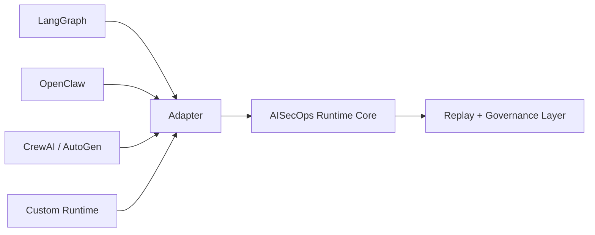

## Open Source

The AISecOps Interceptor is the open-source runtime governance platform for agentic AI.

It is no longer just a policy gateway. The current implementation includes Runtime Governance APIs, Replay Diff Engine, Agent Identity Layer, Compliance Evidence Export, Risk Explanation Engine, MCP Policy Proxy, Local Enforcement Mode, structured audit events, and an interactive Replay Audit UI with execution graph visualization.

**Current OSS release:** v1.0.0 - Replay Diff Engine + Evidence Export  
**Repository:** [github.com/viplavfauzdar/aisecops-interceptor](https://github.com/viplavfauzdar/aisecops-interceptor)  
**License:** Apache 2.0

---

### What Is Here

AISecOps Interceptor provides a framework-agnostic runtime governance layer for agentic AI systems.

It covers:

- prompt and output inspection
- local enforcement mode
- capability-gated tool execution
- agent identity validation
- provenance-aware policy evaluation
- approval-required workflows
- structured JSONL audit logging
- runtime governance APIs
- replay diff and compliance evidence export
- replayable runtime forensics
- Replay Audit UI for investigation workflows
- execution graph visualization

The project demonstrates the core AISecOps runtime model:

```text
Agent → Plan Extraction → Capability Validation → Policy Evaluation → Runtime Controls → Execute → Audit → Replay Diff → Evidence
```

This is not a prototype. It is the working runtime core described throughout the AISecOps architecture, threat model, and enterprise governance material.

---

### The Repository

**[github.com/viplavfauzdar/aisecops-interceptor ↗](https://github.com/viplavfauzdar/aisecops-interceptor)**

- Python backend
- FastAPI runtime API
- React / Vite Replay Audit UI
- Apache 2.0 license
- Works with Python 3.11–3.13

---

### Runtime Governance Core

AISecOps Interceptor separates planning from execution.

Instead of allowing a model or agent to directly invoke tools, the runtime constructs an explicit execution plan and evaluates it before execution.

```text
LLM / Agent → Structured Plan Extraction
AISecOps Interceptor → Policy Evaluation + Runtime Controls
Executor → Act
Audit Layer → Replay Diff + Evidence Export
```

This creates deterministic governance boundaries between:

- planning
- policy evaluation
- approvals
- execution
- replay investigation

The runtime may return:

- `allow`
- `block`
- `require_approval`
- `dry_run`
- `explain`

---

### Capability-Gated Execution

Agents do not receive unrestricted tool access.

Tool execution is evaluated against explicit capability definitions before policy enforcement occurs.

Example capability patterns:

- customer read access
- infrastructure restart operations
- shell execution restrictions
- incident management workflows
- outbound communication controls
- sensitive data export limitations

This prevents agents from escalating privileges through prompt manipulation, ambiguous runtime state, or chained tool behavior.

---

### Runtime Provenance

AISecOps tracks where instructions originate.

Runtime events may include provenance from:

- user prompts
- system prompts
- skills
- memory
- retrieval chunks
- agent messages
- tool outputs

Example provenance:

```json
{
  "source_type": "skill",
  "source_name": "untrusted_openclaw_skill",
  "trust_level": "unverified"
}
```

This allows runtime investigation to answer:

```text
What action was attempted?
Why was it attempted?
Where did the instruction originate?
Was the source trusted?
```

---

### Replay APIs

AISecOps exposes replay APIs for runtime reconstruction.

```text
GET /replay
GET /replay/{trace_id}
GET /replay/{trace_id}/summary
```

Replay APIs reconstruct execution history from structured JSONL audit events.

Replay data includes:

- trace identifiers
- event counts
- final decisions
- decision reasons
- provenance summaries
- execution plan identifiers
- ordered timelines
- tool execution paths

These APIs power the Replay Audit UI, replay diff review, compliance evidence export, and future governance integrations.

---

### Replay Audit UI

The Replay Audit UI provides runtime investigation workflows for AI agent executions.

Features include:

- replay trace list
- decision filtering
- replay timeline reconstruction
- replay diff review
- provenance badges
- raw JSON inspection
- event detail drawers
- execution graph visualization

#### Replay Trace List

Replay summaries expose runtime decisions, event counts, provenance trust levels, and execution outcomes.


#### Replay Timeline

Replay timelines reconstruct planning, evaluation, approvals, execution, and final governance decisions in execution order.


#### Execution Graphs

Execution graphs visualize provenance-aware runtime flow from instruction source through execution outcome.


---

### Structured Audit Events

AISecOps emits structured runtime events for replay and investigation.

Audit events include:

- `schema_version`
- `event_id`
- `trace_id`
- `execution_plan_id`
- `event_type`
- `decision_stage`
- `agent_name`
- `tool_name`
- `decision`
- `reason`
- `provenance`
- `timestamp`

This makes audit events usable as replayable forensic evidence rather than passive application logs.

---

### Swagger API Surface

The FastAPI API exposes interactive Swagger documentation for local testing and runtime demonstrations.


<br/>

Replay endpoints are also exposed through Swagger, including trace replay and replay summary APIs.


<br/>


---

### Quick Start

```bash
# create environment
python3.13 -m venv .venv
source .venv/bin/activate

# install dependencies
pip install -r requirements.txt

# run tests
pytest -q

# run API
uvicorn aisecops_interceptor.api.main:app --reload

# run dashboard
cd dashboard
npm install
npm run dev
```

Python 3.11 through 3.13 supported.

---

### Policy Bundle Example

Define runtime governance policy in YAML:

```yaml
rules:
  - tool_name: restart_service
    agent_name: ops_agent
    action: require_approval

  - tool_name: read_customer
    sensitivity_level: high
    action: block

  - tool_name: send_email
    action: require_approval
```

Load at runtime:

```python
policy = PolicyEngine.from_yaml("policies/production.yaml")
```

Bundles are validated before runtime execution.

---

### Repository Structure

```text
aisecops_interceptor/

  core/           interceptor, policy, approval, audit,
                  context, decision, execution, events

  replay/         replay engine, trace reconstruction,
                  replay summaries

  guard/          detectors, input inspector, output inspector

  llm/            providers, pipeline, config, models

  policy/         rule engine, schema, loader

  integrations/   LangGraph adapter, OpenClaw adapter

  api/            FastAPI runtime APIs

  dashboard/      Replay Audit UI + execution graphs
```

---

### Framework Integration

The interceptor integrates with any agent framework through thin adapters.

Current integrations:

- LangGraph-style
- OpenClaw-style
- generic runtime adapters


```mermaid
flowchart LR

A[LangGraph]
B[OpenClaw]
C[CrewAI / AutoGen]
D[Custom Runtime]

A --> E[Adapter]
B --> E
C --> E
D --> E

E --> F[AISecOps Runtime Core]
F --> G[Replay + Governance Layer]
```

---

### Why This Matters

AI agents are moving from chat systems to execution systems.

They can:

- call tools
- access APIs
- query internal systems
- trigger workflows
- send messages
- modify infrastructure
- interact autonomously with enterprise environments

Traditional application logging is insufficient for understanding runtime agent behavior.

AISecOps is designed to make runtime behavior:

- governable
- replayable
- explainable
- attributable
- inspectable
- auditable

The goal is not only to block unsafe actions.

The goal is to reconstruct:

```text
what happened,
why it happened,
and where the instruction originated.
```

---

### What Is Coming Next

Current roadmap focus:

- richer execution graph analysis
- replay comparison across policy versions
- signed provenance and trust registries
- distributed trace reconciliation
- policy drift detection
- deeper agent framework integrations
- enterprise deployment patterns

---

V

Viplav Fauzdar

Building AISecOps as a discipline and open-source runtime governance reference implementation.
Focused on practical, shipped security for agentic AI systems.

[Medium ↗](https://medium.com/@viplav.fauzdar) [GitHub ↗](https://github.com/viplavfauzdar) [LinkedIn ↗](https://linkedin.com/in/viplavfauzdar)

---

### Related Pages

- [Runtime Forensics →](https://aisecops.net/runtime-forensics)
- [Threat Model for Agentic AI →](https://aisecops.net/threat-model)
- [Reference Architecture →](https://aisecops.net/reference-architecture)
- [Definition: What Is AISecOps? →](https://aisecops.net/definition)
- [I Built a Runtime Forensics Layer for AI Agents →](https://medium.com/@viplav.fauzdar/i-built-a-runtime-forensics-layer-for-ai-agents-7e7c651cd758)
