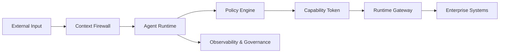
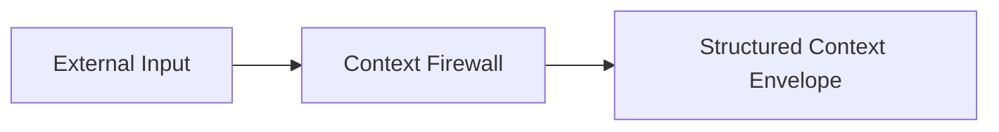
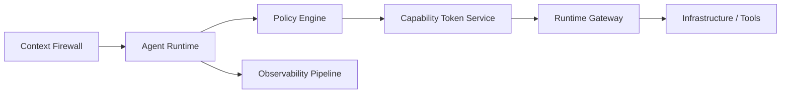
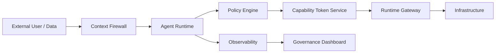
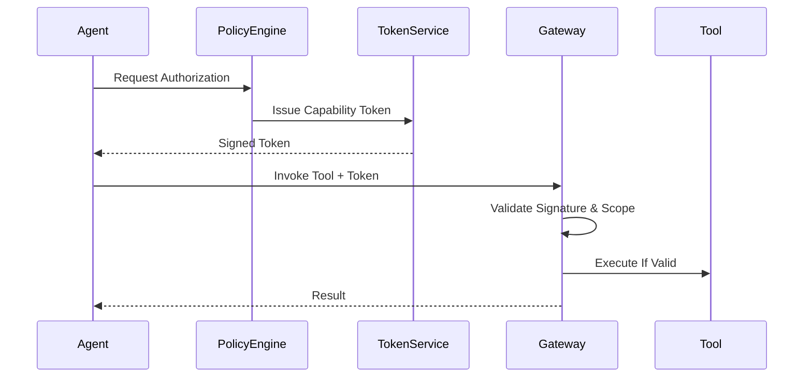
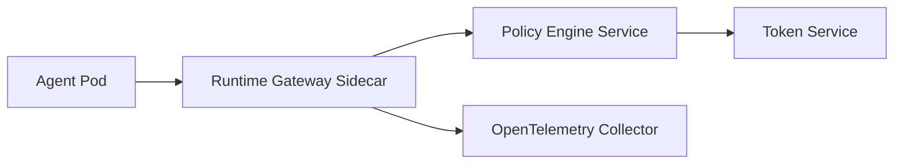

# AISecOps v0.1
## Artificial Intelligence Security Operations
### A Specification for Governing Agentic AI Systems

**Author:** Viplav Fauzdar  
**Version:** 0.1 (Foundational Draft)  
**Date:** February 2026  
**Canonical URL:** https://aisecops.net  
**Status:** Living Industry Specification  

---

# Foreword

AISecOps is introduced as a distinct discipline separate from DevSecOps and MLOps. 

- DevSecOps secures deterministic software delivery pipelines.
- MLOps governs model training, validation, and deployment.
- AISecOps governs autonomous reasoning and runtime action execution.

Agentic AI systems introduce dynamic decision-making authority that traditional security models do not adequately constrain. AISecOps defines the runtime governance layer required for safe enterprise adoption of autonomous systems.

---

# Executive Summary for Security & Platform Leaders

Agentic systems are already being deployed across:

- CI/CD automation
- Infrastructure orchestration
- Customer support workflows
- Code generation pipelines
- Knowledge retrieval systems

Without runtime enforcement, these systems can:

- Escalate privileges
- Exfiltrate sensitive data
- Chain benign actions into harmful outcomes
- Propagate injection attacks across systems

AISecOps introduces:

1. Explicit capability enforcement
2. Runtime gateway authorization
3. Chain-risk aggregation modeling
4. Continuous adversarial evaluation
5. Measurable maturity scoring

Organizations adopting AISecOps gain structured, auditable governance over autonomous AI systems.

---

# AISecOps Visual Model (High-Level)



This model illustrates separation between reasoning, authorization, and execution authority.

---

---

# Abstract

AISecOps (Artificial Intelligence Security Operations) is a formal security discipline for governing agentic AI systems operating in production environments. It extends DevSecOps by introducing runtime governance, bounded autonomy, structured observability, and holistic chain-risk modeling for autonomous systems.

This specification defines:

- Normative security requirements  
- Architectural enforcement layers  
- Control plane and data plane separation  
- Runtime authorization models  
- Risk aggregation formulas  
- Secure agent lifecycle requirements  
- Maturity scoring methodology  
- Governance and ecosystem roadmap  

The key words **MUST**, **SHALL**, **SHOULD**, and **MAY** are to be interpreted as described in RFC 2119.

---

# 1. Problem Statement

Agentic AI systems:

- Reason non-deterministically  
- Select tools dynamically  
- Execute multi-step workflows  
- Persist contextual memory  
- Operate without immediate human supervision  

Traditional DevSecOps assumes deterministic execution and static permission boundaries. Agentic systems invalidate that assumption.

AISecOps exists to secure:

1. The reasoning boundary  
2. The capability boundary  
3. The execution boundary  
4. The observability boundary  
5. The governance lifecycle  

---

# 2. Terminology

**Agent** — A goal-directed AI system capable of invoking tools.  
**Tool** — An external callable capability (API, database, file system, service).  
**Capability Token** — A short-lived, cryptographically signed authorization artifact.  
**Runtime Gateway** — Enforcement boundary for all tool execution.  
**Context Firewall** — Pre-processing layer that validates, isolates, and structures input context.  
**Policy Engine** — Control-plane decision system for authorization and risk evaluation.  
**Chain Risk** — Aggregated cumulative risk across multi-step execution.  
**AISecOps CI** — Continuous adversarial evaluation harness.  
**Control Plane** — Governance and policy decision layer.  
**Data Plane** — Agent reasoning and execution layer.

---

# 3. Threat Taxonomy

AISecOps defines five primary threat classes.

## 3.1 Prompt Injection
Untrusted context alters system reasoning logic.

## 3.2 Tool Abuse
Agent escalates privilege via excessive tool authority.

## 3.3 Memory Poisoning
Persistent manipulation of stored reasoning state.

## 3.4 Chain Escalation
Individually allowed steps collectively violate intent.

## 3.5 Data Exfiltration
Sensitive data exits defined trust boundaries.

---

# 4. Seven Core Principles

## 4.0 Principle Control Mapping

Each core principle maps to one or more formal control IDs defined in Section 16.

- Principle 4.1 → AIS-CTX-01, AIS-CTX-02
- Principle 4.2 → AIS-CAP-01, AIS-CAP-02
- Principle 4.3 → AIS-EXE-01
- Principle 4.4 → AIS-RSK-01
- Principle 4.5 → AIS-OBS-01
- Principle 4.6 → AIS-RSK-01
- Principle 4.7 → AIS-GOV-01

## 4.1 Context Is Untrusted by Default
All external context MUST be treated as adversarial.

## 4.2 Explicit Least-Privilege Capabilities
Agents SHALL NOT possess implicit authority.

## 4.3 Externalized Runtime Authorization
All state-changing actions MUST pass an external policy engine.

## 4.4 Bounded Autonomy
Execution MUST be constrained via sandboxing, rate limits, and budgets.

## 4.5 Structured Observability
All reasoning and execution MUST be reconstructable.

## 4.6 Holistic Chain Risk Evaluation
Security MUST consider cumulative action impact.

## 4.7 Continuous Governance
Security posture MUST evolve through evaluation and incident review.

---

# 5. Four-Layer Security Architecture

## 5.1 Layer 1 — Context (Trust Boundary)

Context Firewall MUST:

- Separate system policy from user content  
- Label trust tiers  
- Attach provenance metadata  
- Validate structured outputs  



---

## 5.2 Layer 2 — Capability (Authorization Boundary)

Agents MUST request scoped authorization before invoking tools.

### Capability Token Schema

```json
{
  "agent_id": "agent-123",
  "tool": "db.write",
  "scope": "project.alpha.orders",
  "constraints": {
    "max_rows": 100,
    "max_cost": 0.50,
    "expiry": "2026-03-02T17:00:00Z"
  },
  "risk_score": 0.42,
  "policy_version": "v0.1"
}
```

Tokens MUST be:

- Short-lived  
- Signed  
- Scope-bound  
- Versioned  
- Auditable  

---

## 5.3 Layer 3 — Execution (Enforcement Boundary)

All tool calls SHALL pass through a Runtime Gateway.

Gateway MUST:

- Validate capability token  
- Enforce scope constraints  
- Enforce execution budgets  
- Apply egress controls  
- Emit structured telemetry  

---

## 5.4 Layer 4 — Observability (Governance Boundary)

Telemetry MUST include:

- run_id  
- agent_id  
- prompt_hash  
- context_provenance  
- tool_invocations  
- policy_decisions  
- cumulative_risk_score  
- budget_consumption  

---

# 6. Reference Architecture



All components MUST be logically separable even if physically co-located.

---

# 7. Control Plane vs Data Plane Separation

## 7.1 Data Plane
- Agent reasoning  
- Tool execution  
- Memory updates  

## 7.2 Control Plane
- Policy evaluation  
- Risk scoring  
- Token issuance  
- Budget configuration  
- Governance metrics  

Security decisions SHALL occur in the control plane.

---

# 8. Risk Aggregation Model

Let:

- R_step = Base risk per action  
- E = Escalation multiplier  
- T = Trust modifier  
- B = Budget stress factor  

Cumulative Risk:

R_total = Σ (R_step × E × T × B)

If R_total > threshold:
- Execution MUST halt OR
- Human approval MUST be required  

---

# 9. Secure Agent SDLC

Agent release MUST include:

1. Threat model review  
2. Tool permission audit  
3. Injection regression testing  
4. Chain escalation simulation  
5. Policy validation  
6. Budget boundary validation  

---

# 10. AISecOps CI (Continuous Evaluation)

Evaluation harness SHALL include:

- Prompt injection tests  
- Tool abuse simulations  
- Memory poisoning tests  
- Data exfiltration tests  
- Budget overflow tests  

Failure SHALL block production deployment.

---

# 11. Implementation Patterns

## 11.1 Budgeted Autonomy

Agent execution MUST define:

- max_tool_calls  
- max_write_operations  
- max_execution_time  
- max_cost  

## 11.2 Holistic Chain Evaluation (Pseudocode)

```python
risk_total = 0
for step in chain:
    risk_total += step.base_risk * step.escalation * step.trust_modifier

if risk_total > POLICY_THRESHOLD:
    require_human_approval()
```

---

# 12. AISecOps Maturity Model

| Level | Runtime Enforcement | Evaluation | Governance | Risk Modeling |
|-------|-------------------|------------|------------|--------------|
| 0 | None | None | None | None |
| 1 | Prompt Controls | Minimal | Manual | None |
| 2 | Tool-Level | Partial | Manual | Step-Level |
| 3 | Full Runtime | Yes | Structured | Chain-Level |
| 4 | Adaptive | Continuous | Automated | Dynamic |

---

# 13. Compliance & Framework Alignment (Preview)

Future versions SHALL include mapping to:

- NIST AI Risk Management Framework  
- Zero Trust Architecture  
- SOC 2 controls  
- ISO 27001  

---

# 14. Open Ecosystem & Roadmap

v0.2 — Formal control matrix  
v0.3 — Compliance appendix  
v1.0 — Reference runtime gateway  

AISecOps MAY evolve toward foundation governance.

---

# 15. Call to Action

An AISecOps-compliant system MUST:

1. Enforce runtime authorization  
2. Separate reasoning from execution authority  
3. Maintain structured telemetry  
4. Continuously evaluate adversarial threats  
5. Measure and publish maturity progression  

Secure reasoning MUST become as standard as secure deployment.

---


# 16. Formal Control Matrix

The following control matrix defines enforceable AISecOps requirements.

| Control ID | Control Objective | Enforcement Layer | Mandatory | Description |
|------------|------------------|------------------|-----------|------------|
| AIS-CTX-01 | Context Isolation | Layer 1 | MUST | System policy MUST be isolated from user-provided content. |
| AIS-CTX-02 | Provenance Labeling | Layer 1 | MUST | All retrieved or external context MUST include provenance metadata. |
| AIS-CAP-01 | Explicit Capability Grant | Layer 2 | MUST | Agents MUST request scoped capability tokens before tool invocation. |
| AIS-CAP-02 | Token Expiry | Layer 2 | MUST | Capability tokens MUST be short-lived and signed. |
| AIS-EXE-01 | Gateway Enforcement | Layer 3 | MUST | All tool calls SHALL traverse a runtime gateway. |
| AIS-OBS-01 | Structured Telemetry | Layer 4 | MUST | All runs MUST emit structured telemetry events. |
| AIS-RSK-01 | Chain Risk Calculation | Cross-Layer | MUST | Cumulative risk SHALL be computed for multi-step execution. |
| AIS-GOV-01 | Continuous Evaluation | Governance | MUST | AISecOps CI MUST block non-compliant releases. |

---

# 17. Trust Boundary & Data Flow Model



Trust Boundaries:

- Boundary A: External Input → Context Firewall  
- Boundary B: Agent Runtime → Policy Engine  
- Boundary C: Runtime Gateway → Infrastructure  
- Boundary D: Observability → Governance

---

# 18. Runtime Token Validation Sequence



Runtime gateways MUST reject:

- Expired tokens
- Scope violations
- Budget overruns
- Invalid signatures

---

# 19. Governance Dashboard Reference Model

An enterprise AISecOps dashboard SHOULD include:

## 19.1 Operational Metrics
- Total agent runs
- Average cumulative risk score
- Budget violation rate
- Tool invocation distribution

## 19.2 Security Metrics
- Injection test pass rate
- Chain escalation detection rate
- Policy denial frequency
- Data egress attempts

## 19.3 Maturity Indicators
- % of tool calls policy-enforced
- % of runs fully traced
- Mean time to containment

Dashboard outputs SHALL feed continuous policy refinement.

---

# 20. NIST AI Risk Management Framework Mapping (Preview)

| AISecOps Control | NIST AI RMF Function | Alignment Description |
|------------------|---------------------|----------------------|
| Context Isolation | Govern | Establishes trust boundaries for AI inputs |
| Capability Enforcement | Map | Defines operational AI system boundaries |
| Runtime Gateway | Measure | Enables runtime risk measurement |
| Risk Aggregation | Manage | Supports adaptive mitigation |
| Continuous Evaluation | Govern | Institutionalizes AI risk governance |

Future versions SHALL include full control-by-control mapping.

---

# 21. Conformance Requirements

An AISecOps-conformant system MUST satisfy all mandatory controls defined in Section 16.

## 21.1 Minimum Conformance Criteria

To claim AISecOps Level 3 compliance, a system MUST:

- Enforce capability tokens for all tool invocations (AIS-CAP-01, AIS-EXE-01)
- Emit structured telemetry for every agent run (AIS-OBS-01)
- Compute cumulative chain risk for multi-step execution (AIS-RSK-01)
- Block production release on CI security failure (AIS-GOV-01)

## 21.2 Full Conformance (Level 4)

A Level 4 AISecOps system SHALL additionally:

- Implement dynamic risk scoring adjustments
- Maintain automated governance dashboards
- Continuously refine policies based on telemetry feedback

## 21.3 Declaration of Compliance

Organizations claiming AISecOps compliance SHOULD publish:

- Current maturity level
- Control coverage percentage
- Date of last evaluation
- Known control gaps (if any)


Conformance declarations MUST be auditable.

---

# 22. Security Considerations

AISecOps-compliant systems MUST assume adversarial pressure at all reasoning boundaries.

## 22.1 Model Manipulation Risk
Large Language Models MAY produce unsafe reasoning even when upstream controls exist. Runtime enforcement MUST NOT rely solely on prompt constraints.

## 22.2 Cross-System Propagation Risk
Agent outputs consumed by downstream agents create cascading risk amplification. Cross-agent chains SHALL be evaluated as a single cumulative execution graph.

## 22.3 Latent Authority Drift
Over time, policy configurations MAY unintentionally expand capability scope. Organizations SHOULD implement periodic policy diff audits.

## 22.4 Supply Chain Risk
Tool integrations (APIs, SDKs, plugins) introduce external risk. All external integrations MUST be enumerated and periodically reviewed.

---

# 23. Threat Modeling Worksheet (Template)

The following template MAY be used during agent design reviews.

## 23.1 Agent Overview
- Agent Name:
- Intended Goals:
- Tool Access Scope:
- External Data Sources:

## 23.2 Threat Identification
- Injection Vectors:
- Privilege Escalation Paths:
- Data Egress Paths:
- Chain Escalation Risks:

## 23.3 Mitigation Controls
- Context Controls Applied:
- Capability Constraints:
- Budget Limits:
- Telemetry Coverage:

## 23.4 Residual Risk Assessment
- Estimated Chain Risk Score:
- Manual Approval Requirements:
- Known Gaps:

Threat modeling documentation SHALL be retained for audit.

---

# 24. Sample Policy DSL (Illustrative)

The following pseudocode illustrates a capability enforcement policy.

### Rego-style Example

```rego
allow_tool_invocation {
  input.token.scope == "project.alpha.orders"
  input.token.expiry > now()
  input.risk_score < 0.75
}
```

### Cedar-style Example

```cedar
permit(
  principal == Agent::"agent-123",
  action == Action::"db.write",
  resource in Project::"alpha.orders"
)
when {
  context.risk_score < 0.75
};
```

Policies MUST be externalized from the agent reasoning loop.

---

# 25. Kubernetes-Native Deployment Blueprint (Reference)

An enterprise AISecOps deployment MAY include:

- Agent Runtime Deployment (Kubernetes Deployment)
- Runtime Gateway (Sidecar or API Gateway)
- Policy Engine (OPA / Cedar Service)
- Capability Token Service (Internal Auth Service)
- Observability Stack (OpenTelemetry + SIEM)



All runtime gateway instances SHALL be horizontally scalable.

---

# 26. Reference Implementation Requirements

An official AISecOps reference implementation SHOULD:

1. Provide a pluggable runtime gateway
2. Support capability token validation
3. Emit structured OpenTelemetry traces
4. Integrate with a policy engine (OPA, Cedar, or equivalent)
5. Provide sample injection and chain-risk tests
6. Include a maturity scoring dashboard

Reference implementations MUST document known limitations.

---

# Appendix A — Citation

Fauzdar, V. (2026). AISecOps v0.1: Artificial Intelligence Security Operations. https://aisecops.net

---

#
# Appendix C — Version History & Change Log

## v0.1 (February 2026)
- Initial foundational specification
- Defined four-layer security architecture
- Introduced formal control matrix
- Added risk aggregation model
- Added maturity framework
- Added conformance requirements
- Added governance dashboard model
- Added Kubernetes deployment blueprint

Future versions SHALL document control additions and architectural modifications.

---

# Appendix D — Version Hash

Document Version: AISecOps-v0.1
Status: Foundational Draft
Last Updated: February 2026
Canonical Source: https://aisecops.net

Organizations SHOULD reference the version identifier when claiming compliance.

---

# Appendix B — Versioning Policy

Minor versions:
- Clarifications
- Non-breaking control additions  

Major versions:
- Principle modifications  
- Architectural changes  
